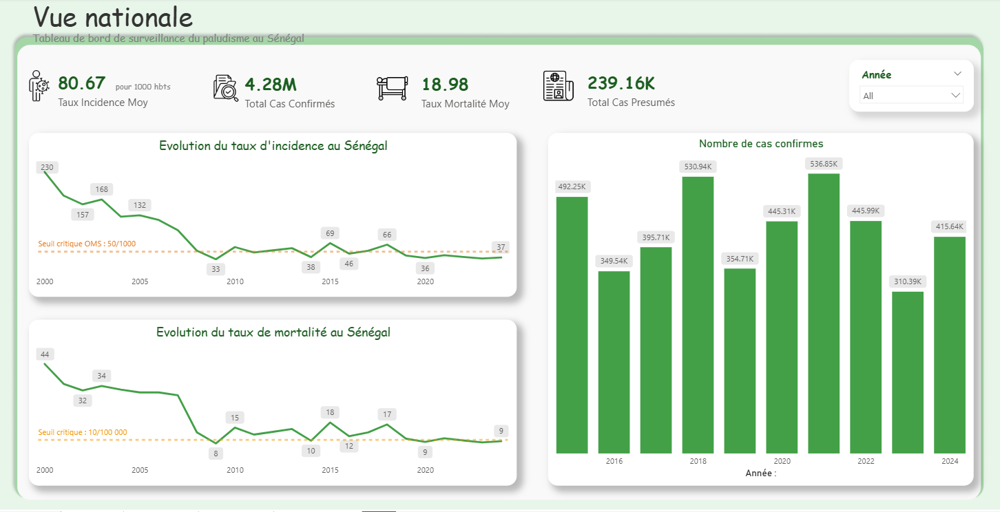
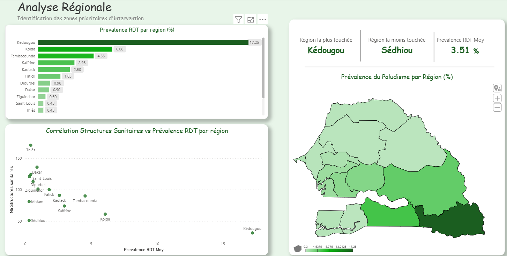
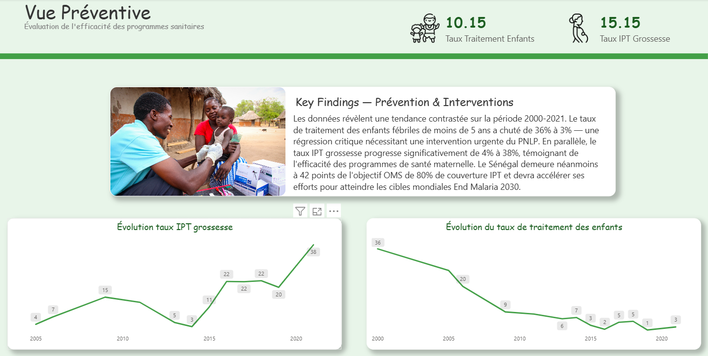
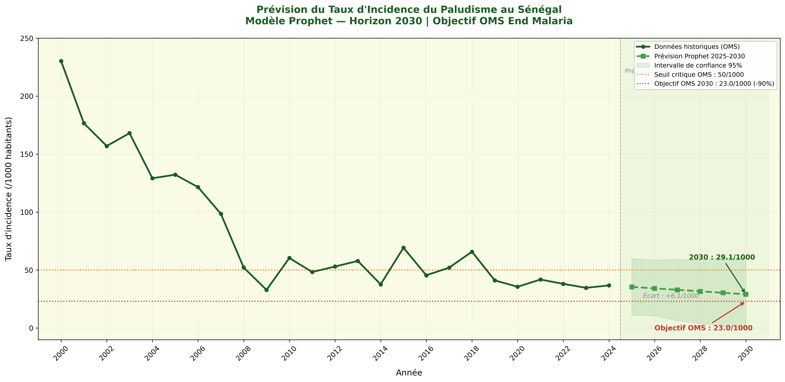

<div align="center">


</div>

# Pipeline de données — Surveillance du paludisme au Sénégal

Pipeline ETL complet pour la surveillance épidémiologique
du paludisme au Sénégal (2000-2024). Intègre quatre sources
internationales, modélise une base SQL Server en schéma en
flocon, produit un tableau de bord Power BI interactif et
prédit l'incidence à l'horizon 2030 avec Prophet.

Projet de fin d'études — Bachelor Statistique et Informatique
Décisionnelle, BEM Dakar (2025-2026).

---

## Stack technologique

- Python 3.x — pandas, sqlalchemy, unicodedata, prophet, scipy
- SQL Server Express — schéma en flocon (6 tables)
- Power BI Desktop — 13 mesures DAX
- Prophet (Meta) — prévisions 2025-2030

---

## Sources de données

| Source | Couverture |
|---|---|
| OMS / HDX | Indicateurs nationaux 2000-2024 |
| DHS / HDX | Prévalence régionale 2010-2017 |
| Banque Mondiale / HDX | Indicateurs prévention 2000-2021 |
| HDX | 1 345 structures sanitaires géolocalisées |

---

## Résultats

- Réduction de 84% du taux d'incidence entre 2000 et 2024
- Disparité régionale : Kédougou 17,25% vs Dakar 0,43%
- Prédiction Prophet 2030 : 29,11/1000 — écart OMS : +6,07 points

---

## Tableau de bord Power BI

**Vue Nationale — évolution sur 25 ans**



**Analyse Régionale — disparités géographiques**



**Vue Préventive — programmes de prévention**



---

## Prévision Prophet 2025-2030



---

## Schéma en flocon — base paludisme_senegal


---

## Structure du projet

```
├── 03_scripts/
│   ├── 02_transformation/
│   │   ├── 01_nettoyage.py
│   │   └── 02_transformation.py
│   └── 03_chargement/
│       └── chargement_etl.py
├── 04_base_donnees/
│   └── create_tables.sql
├── 06_ml_models/
│   └── 01_prophet_incidence.py
└── 07_outputs/
├── previsions_incidence_2025_2030.csv
├── prophet_prediction_incidence.png
├── schema_flocon_paludisme.png
├── dashboard_vue_nationale.png
├── dashboard_analyse_regionale.png
└── dashboard_vue_preventive.png

## Installation

```bash
pip install pandas sqlalchemy pyodbc prophet matplotlib scipy
```

Créer un fichier `.env` :

DB_SERVER=ANNA/SQLEXPRESS
DB_NAME=paludisme_senegal
DB_USER=#####
DB_PASSWORD=#####

## Exécution

```bash
python 03_scripts/02_transformation/01_nettoyage.py
python 03_scripts/02_transformation/02_transformation.py
# Exécuter create_tables.sql dans SSMS
python 03_scripts/03_chargement/chargement_etl.py
python 06_ml_models/01_prophet_incidence.py
```

## Auteure
Anna Jobe
